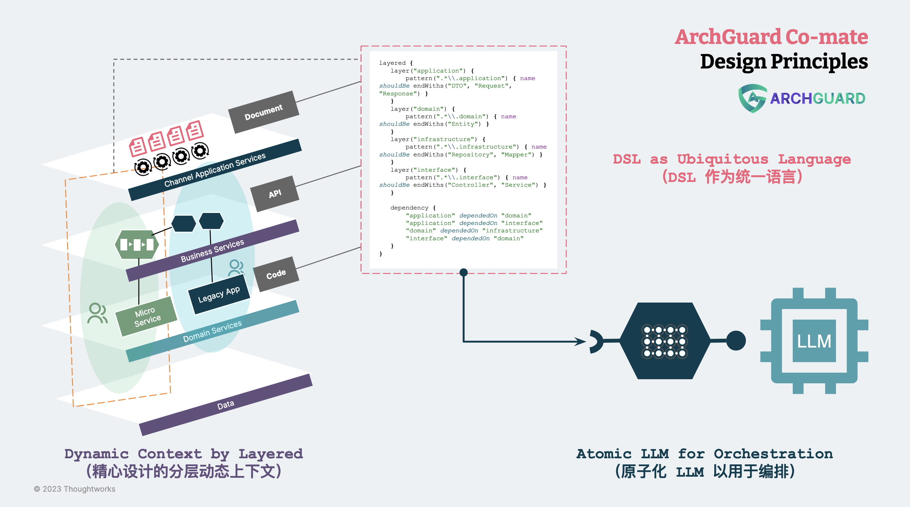

# LLM 架构设计原则：上下文工程

上下文工程是一种让 LLM 更好地解决特定问题的方法。它的核心思想是，通过给 LLM
提供一些有关问题的背景信息，比如指令、示例等，来激发它生成我们需要的答案或内容。上下文工程是一种与 LLM 有效沟通的技巧，它可以让
LLM 更准确地把握我们的目的，并且提升它的输出水平。

简而言之，上下文工程是如何在有限的 token 空间内，传递**最相关的上下文信息**。

## 上下文工程的原则

所以，我们就需要定义什么是该场景下的，**最相关的上下文信息**。

### 原则：基于场景与旅程的上下文设计

它的基本思想是，通过分析用户在不同场景下的操作和行为，来获取与当前任务相关的上下文信息，从而指导 LLM 生成最佳的代码提示。

Copilot 分析了用户在不同场景下的操作和行为，如何使用 IDE 的旅程，以及与当前任务相关的指令和例子等信息，从而获取最相关的上下文信息。这些上下文信息可以帮助
LLM 更好地理解用户的意图，并生成更准确、更有用的代码提示。

例如，在用户编写 JavaScript
代码时，Copilot会分析用户在编辑器中的光标位置、当前文件的内容、变量、函数等信息，以及用户的输入历史和使用习惯等上下文信息，来生成最相关的代码提示。这些代码提示不仅能够提高用户的编码效率，还能够帮助用户避免常见的编程错误。

### 原则：就地矢量化（Vector）与相似度匹配

“众知周知”，在 LLM 领域非常火的一个工具是 LangChain，它的处理过程类似于 langchain-ChatGLM 总结的：

> 加载文件 -> 读取文本 -> 文本分割 -> 文本向量化 -> 问句向量化 -> 在文本向量中匹配出与问句向量最相似的`top k`个 ->
> 匹配出的文本作为上下文和问题一起添加到`prompt`中 -> 提交给`LLM`生成回答。
>

为了处理大规模的自然语言处理任务，Copilot 在客户端使用了 Cushman + ONNX 模型处理。具体来说，Copilot 将 Cushman
模型的输出转换为向量表示，然后使用向量相似度计算来匹配最相关的本地文件。

除了就地矢量化（Vector）与相似度匹配，Copilot 还使用了本地的相似计算与 token 处理来管理 token，以便更好地处理大规模自然语言处理任务。

### 原则：有限上下文信息的 Token 分配

而由于 LLM 的处理能力受到 token 数的限制，如何在有限的 token 范围内提供最相关的上下文信息，便是另外一个重要的问题。

诸如于如上所述的 Copilot 本地 prompt 分为了 prefix 和 suffix 两部分，在 suffix 部分需要配置
suffixPercent，其用于指定在生成代码提示时要用多少 prompt tokens 来构建后缀，默认值似乎是 15%。

通过增加 suffixPercent，可以让 Copilot 更关注当前正在编写的代码片段的上下文信息，从而生成更相关的代码提示。而通过调整
fimSuffixLengthThreshold，可以控制 Fill-in-middle 的使用频率，从而更好地控制生成的代码提示的准确性。
