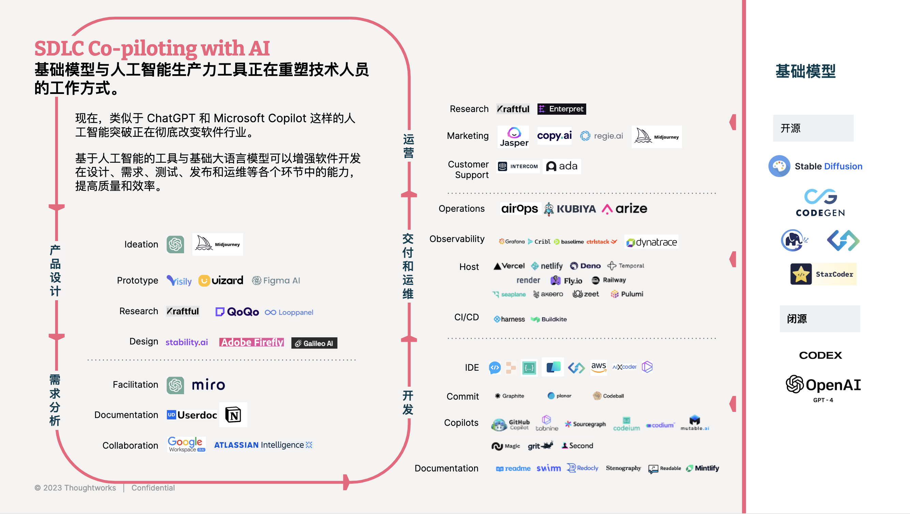
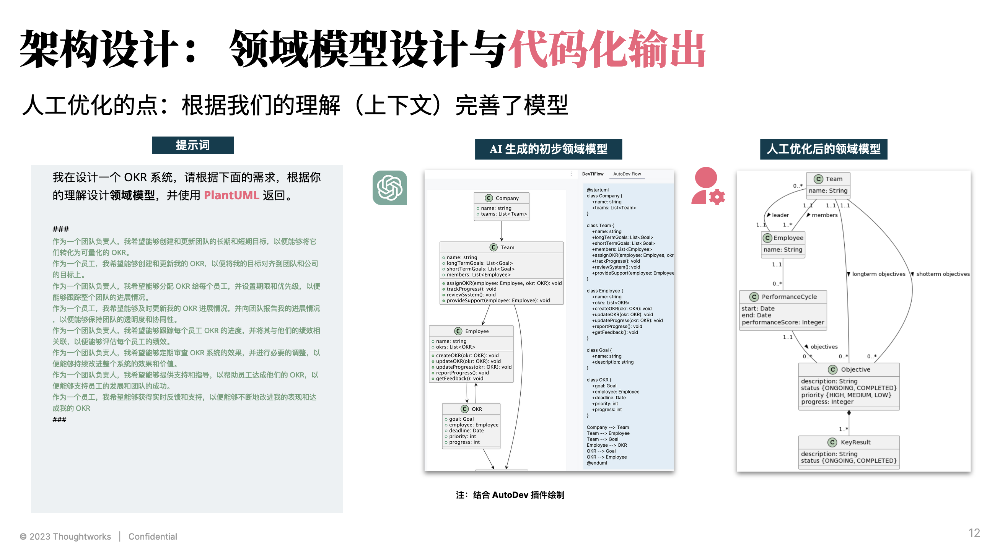

# LLM 应用示例：AI + DevOps

现在，类似于 ChatGPT 和 Microsoft Copilot 这样的人工智能突破正在彻底改变软件行业。
基于人工智能的工具与基础大语言模型可以增强软件开发在设计、需求、测试、发布和运维等各个环节中的能力，提高质量和效率。



## 方式：梳理研发流程寻找突破点

依旧的，我们需要拆到足够小的工序，才能看到明显的效果。


## 试验

在这里，我们选择了一个比较典型的研发流程：需求、设计、开发、测试、发布、运维。 如下是架构设计的示例：



需要注意的是，在这里需要以 zero-shot 的方式实现，以便于：

1. 更好的理解和使用
2. 工具化集成

### 需求 prompt 示例（部分）

```markdown
你是一个敏捷项目的 BA，请根据如下的信息，编写用户故事。

1. 你的项目是：### OKR 系统 ###
2. 背景是：### 作为一个员工，我希望能够及时更新我的 OKR
   进展情况，并向团队报告我的进展情况，以便能够保持团队的透明度和协同性 ###
2. 我想要实现的功能是： ### 更新 OKR 进度 ###。
3. 你要仔细分析，并尽可能考虑不同的场景，不限于 ### ####。如果场景不存在，请不要编写。
4. 你的返回模板如下所示：

###

用户故事：可以选择宝贝出行服务
作为 xxx
我想 在xx出行的手机客户端里选择宝贝出行服务
以便于 我能够带宝宝打车出行的时候打到有儿童座椅的车

AC 1:  xxx
Given xxx
When xxx
Then xxx

###
```

### 测试用例 prompt 示例（部分）

```markdown
请分析如下的用户故事，按你的理解使用 markdown 表格输出测试用例，格式如下：

所属功能模块 用例编号 用例名称 前置条件 用例类型 操作步骤 优先级 预期结果 关联需求类型
````

### 影响分析 prompt 示例（部分）

```markdown
我在实现一个 OKR 系统 的 作为一个员工，我希望能够及时更新我的 OKR 进展情况，并向团队报告我的进展情况，以便能够保持团队的透明度和协同性
的功能，需要修改哪些服务的代码？


| **服务**   | **功能描述**                                     |
|----------|----------------------------------------------|
| 用户管理服务   | 用于存储和管理员工的基本信息，如姓名、职位等，以便于识别员工并关联他们的 OKR。    |
| 团队管理服务   | 用于存储和管理团队的基本信息，如团队名称、团队成员等，方便员工对齐团队目标。       |
| OKR 管理服务 | 用于创建、更新和删除 OKR，同时支持查询功能，方便员工和团队查看和管理他们的 OKR。 |
| 权限管理服务   | 用于控制不同角色的员工在系统中的权限，确保只有合适的人员可以发布或修改 OKR。     |
| 通知服务     | 当有新的 OKR 发布或修改时，负责通知相关人员，以便他们了解最新的目标和进度。     |
| 数据分析服务   | 对 OKR 数据进行分析，生成报告，以便管理层了解整体的目标完成情况和进度。       |
| 集成服务     | 与其他企业系统（如项目管理、日程管理等）集成，实现数据同步和自动更新 OKR 的功能。  |
```

### ...

