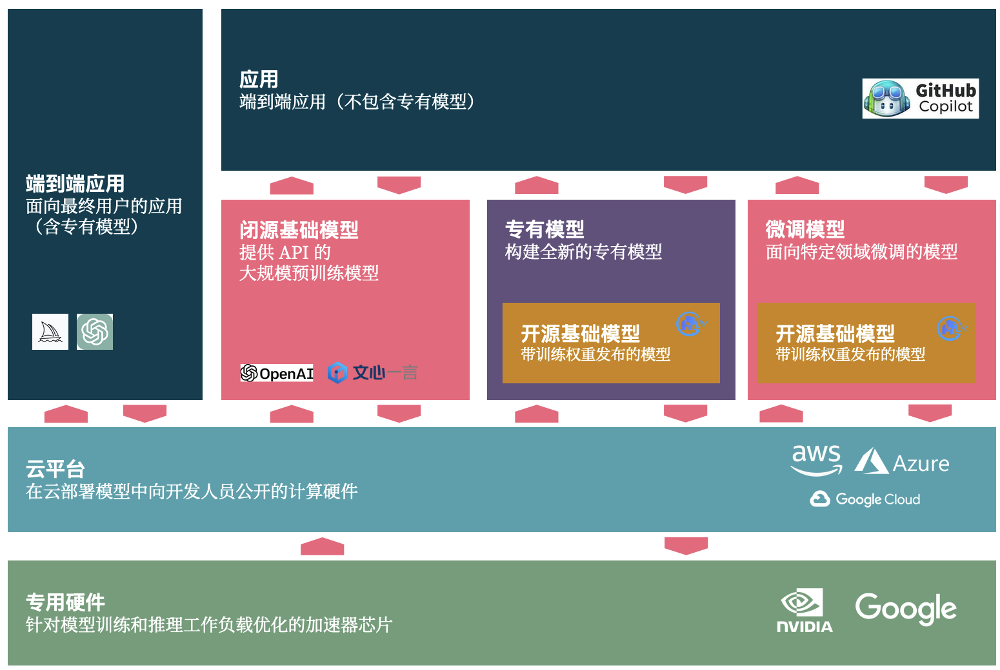

# 开发 LLM 应用之前

在你下决心开发一个 LLM 应用之前，你应该考虑一些问题。

## 买还是开发？

LLM 应用由 LLM + 应用两部分组成，所以会出现类似于下图的多种不同类似应用：

- AI 端到端应用。即直接面向最终用户的应用（含专有模型），诸如 ChatGPT、Midjourney
- 应用 + 闭源基础模型。如基于 OpenAI、文心一言（他们提供了吗，我没收到）等 API 来构建应用。
- 应用 + 专有模型。即基于开源基础模型，或者自有的模型，来构建端到端应用。
- 应用 + 微调模型。基于开源模型 + 面向自己研发场景下来微调，以构建领域特定的应用。

不同的企业应根据自身的业务需求来选择不同的方案。

## 决策框架

## 业务与技术问题？

在业务侧，你应该考虑：

- 你的应用是否需要一个 LLM？
- 寻找合适的、稳定的 LLM 备用 API
- 隐私与数据安全问题
- 未来是否存在私有化部署与微调的可能性？

在技术侧，你应该考虑：

1. 哪些部分可以使用 LLM？ 哪些部分不适合使用 LLM？
2. Prompt 的编写与维护。编写好 prompt 不是一件容易的事情，需要大量的实践与经验。 
3. 优化 LLM 的体验。在速度、准确率、稳定性上，LLM 都有很大的提升空间。

