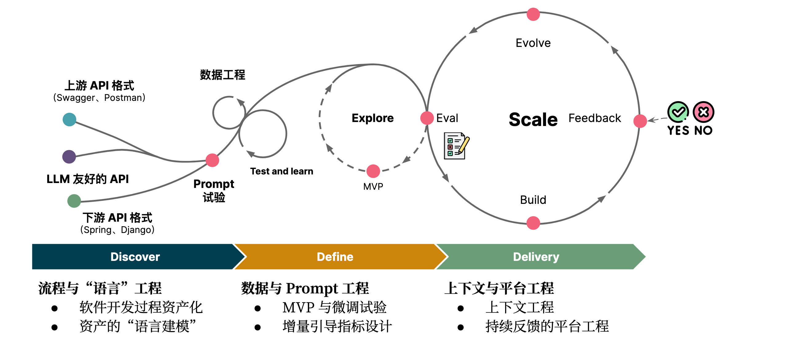

# 微调的三阶六步：LLMOps

在开源大语言模型（LLM）的加持之下，我们可以做到：

1. **集采众长以帮助场景创新**。将相关领域中已开放的专业知识和经验融合到语言模型中，从而辅助探索合适的 API 服务场景 -
   Discover；
2. **资产建模驱动**。将研发组织已有的经典的软件工程的资产，文本化、结构化转变为 LLM
   的语料，充分利用既有经验以定义能够满足服务场景的 API - Define；
3. **标准内建的设计与交付**。将自然语言描述的场景及需求转化为具体的 Restful API
   设计，并结合数据工程与平台工程，持续整合整个组织的软件智慧和经验，以帮助我们构建好的软件架构 - Deliver。

通过利用 LLM 的能力，我们可以更好地应对 API 设计中的挑战，实现数字化价值最大化和 API 成为数字化资产的目标。

## **模式：集体智慧飞轮**

结合我们对于 LLM 的理解与探索，结合 GitHub Copilot 的免费试验过程与逻辑实现。我们基于 ChatGLM 训练了我们的第一个架构辅助设计
LoRA。并根据我们的理解，绘制了一个可复用的过程路径：

在不同的阶段，我们有不同的关注点：

- **Discover 阶段**，关注于**数据与语言工程**。即：训练语料的来源与数据处理，或是来源于对 OpenAI 的数据蒸馏，或是来源于公开的
  API，又或是从代码中提炼 API。
- **Define 阶段**，关注于 **Prompt 工程**。即：设计适用于私有化大模型的 instruction、input 和 output，以及设计**演进式评估**
  所需要的评估数据集。
- **Delivery 阶段**，关注于**平台工程**。即：将 LLM 的应用工程化，“无缝” 接入内部的各种平台和工具，持续处理用户对于数据的反馈，以持续迭代软件数据集。

在此时，LLM 的工程化便是一个跨越不同领域的复杂数据工程活动。将这样的工程标准化、跨不同部门协作、持续迭代下去，则会是我们未来的新挑战。

以 API 为例，我们将上述的三个阶段分解为六步：

- **Discover 阶段**
  - 识别软件工程资产
  - 针对于资产的“语言建模”（格式化输出）
- **Define 阶段**
  - MVP 微调试验
  - 设计增量引导指标
- **Delivery 阶段**
  - LLM 体验设计与工具集成
  - 基于反馈的平台工程

针对于不同的场景下，可能略有差异。

## **三阶六步构建模型友好的智慧飞轮**

### **步骤 1：识别软件工程资产**

在清晰地了解工程过程之后，我们便需要继续深入架构领域，分析我们能怎么去实现。我们定义的第一步是：**识别软件工程资产**
。即在分析如何实现目标之前，需要梳理和了解已有的软件工程过程，以及过程中产生的资产，包括文档、代码、测试用例等等，以便更好地利用这些资产，并将其与
LLM 进行结合，进而来提升研发效率。

在这个阶段，我们采用了经典的用户旅程分析方法：

上图中，包含了五个要素：

1. 工序化。即理想情况下，API 设计的全生命周期的过程应该是怎样的？
2. 工艺现状。我们的现状现在是怎样的？
3. 痛点问题。过程中，不同角色的主要痛点是什么？
4. 工艺改进。如何针对于上述的痛点进行改进？
5. 资产沉淀。过程中会产生哪些关键产出（软件工程资产）？

随后，围绕于我们产出的软件工程资产，便可以进行 LLM 微调试点与探索。

在我们的 LLM 赋能的 API 全生命周期里，我们定义的四个关键资产是：API 规范和结构、软件需求（用户故事）、领域模型、API specs。

### **步骤 2：针对资产的 “语言建模”（格式化输出）**

由于大语言模型本身是文本，所以我们需要对现有的架构资产进行 “语言建模”，简单来说就是将文本结构化，转变为特定的、易于阅读和解析的格式，即领域特定语言（DSL），诸如于
markdown 表格、UML 等。

在同一个场景之下，我们预期 LLM 能返回固定格式的数据，方便我们结合到工具中。尽管没有可信的来源证明： OpenAI 在语料阶段使用
markdown 作为数据，但是从经常性输出 markdown 的结构和 ChatGPT 的渲染来看，markdown 是其中一种 LLM 友好的格式。如：

- 文本生成模型场景下，PlantUML 是最友好的格式之一
- 生成 API 场景下，markdown 是最友好的格式之一

随后，我们定义了 API 的 “语言模型”：

与普通的 markdown 表格差别并大。只是呢，我们在 request、response、error response 中使用了类 json 的格式表示。

这里还有一个关键点是，编写一个**针对于该格式的校验器**，一旦出错可以重来，以提升数据质量、降低出错率等。

### **步骤 3：MVP 微调试验**

在训练之前，我们需要准备一些数据，对于现有的 LLM，我们通常采用如下的：instruction、input、output 的结构方式，并由人或者现有的
AI API 来辅导我们进行数据准备。

出自《**[A Survey of Large Language Models](https://arxiv.org/abs/2303.18223)**》

在进行 MVP 阶段数据处理时，可以考虑多种方式结合：

- 常规双向匹配。
- 数据蒸馏。即将大型真实数据集（训练集）作为输入，并输出一个小的合成蒸馏数据集。
- 反向生成。即基于目标 output 文本生成潜在的 input，以作为数量级。

如下是我们根据 Swagger、Postman 创建数据集的过程：

微调通常不是一次就能完成的，我们需要结合 self-instruct 的模式构建一些通用的指令、prompt。不过，考虑到大部分公司都有 AI
专家能更好地帮助解决这个问题。

### **步骤 4：设计增量引导指标**

为了评估微调、训练的结果，我们需要构建一个增量引导的指标。而在 AI 编程领域，OpenAI 开源的 HumanEval 数据集提供了一个非常好的示例。

HumanEval 通过单元测试自动评估代码示例的正确性。包含了 164 个带有单元测试的原始编程问题的数据集。以用于评估语言理解力、算法和简单的数学，其中一些可与简单的软件面试问题相媲美。

在某种程度上也作为了其它 AI 在语言模型的标准，CodeGen、CodeGeeX 也采用它来进行评估。如下是 CodeGeeX 的评估结果示例：

对于 API 来说，我们同样也正在设计相似类似的方式来构建。如下是我们微调完的 RESTful API 示例：

这里还有几个问题要考虑：

1. 如何有效验证结果是否正确？如 RESTful API 是易于验证的，但是 CRUD 是否合理如何验证呢？
2. 数量级的全面性如何保证？
3. 是否只针对特定领域编写？

尽管指标可以作为一种评价工作或项目进展的方法，但过度依赖指标可能产生指标驱动的风险。但是，我们可以通过构建基于反馈的平台工程，来优化并解决这个问题。

### **步骤 5：LLM 体验设计与工具集成**

在构建了第一个 MVP 之时，我们也在探索如何与工具结合在一起。如在我们的场景之下，采用的是 IDE 插件，便需要开发 IDE 插件来实现。

而针对于 IDE 来说，其过程比较简单，如下图所示：

虽然语法分析难度虽然高了一点点，但是并不是主要的挑战。主要的挑战是，如何去进行交互设计。

如在 GitHub Copilot 的插件便有非常好的体验，支持多种不同交互（快捷键、Inlay、工具栏等）、Code Completion 模式等。在编辑模式内，通过
Intellij IDEA 自带的 InlayModel，可以支持：Inline，AfterLine，Block 三种不同的模式。

考虑到，过往我们已经有了大量的体验设计经验，由于需要注意的点是：**AI 时代是否有更好的交互方式**？

### **步骤 6：基于反馈的平台工程**

与常规应用的度量不同，对于 AI 产品来说，我们需要**非常、非常、非常**关注于用户对结果的反馈，并持续收集这些数据：接受、不接受、改进后的版本（按需）。

与 ChatGPT 不实用的 Like、Dislike 相比，针对于软件资产来说，企业更容易获得改进后的版本，如对于需求的进一步完善。

以代码为例，在 AI 编程工具里，当用户 accept 或者 reject 代码之后，我们就可以记录下这些信息。同时，如果用户对代码进行改动，我们还能将其作为后续训练的数据集。

因此，在我们构建端到端的工具时，需要设计好内部的平台工程，强化反馈回路，以使我们的 AI 更加智能。

## **总结**

利用大语言模型技术，能帮助我们汲取来自不同领域的优秀 API 设计经验和方法，同时融合研发组织自身的经验和实践，以及主流的 API
规范。这有助于提高架构中的 API 设计效率和质量，从而增强整体架构的服务能力和开放性。而具体的提升效果如何，以及引入 LLM 增强的架构治理方式及路径是否会有所变化，还需要更多的实际应用场景来进一步验证。

参考资料：

- 《**[CodeGen: An Open Large Language Model for Code with Multi-Turn Program Synthesis](https://arxiv.org/abs/2203.13474)**》
- 《**[Evaluating Large Language Models Trained on Code](https://arxiv.org/abs/2107.03374)**》
- 《**[A Survey of Large Language Models](https://arxiv.org/abs/2303.18223)**》
