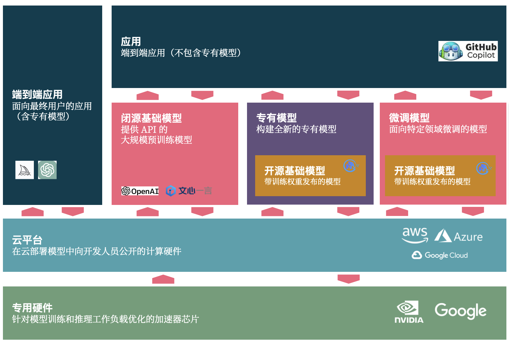

# 程序员的 AI 2.0 新机遇

在过去的几个月里，有大量的 KOL 都在说：所有的应用都可以用 AI 重写一遍。而落地到现有的 DevOps 工具里，假设都需要重写，那么未来的架构可能是怎样的？

对于程序员而言，在 AI 2.0 时代，我们将迎来新的机遇、新的挑战，它可以划分三部分：如何使用 LLM、构建 LLM、创建端到端 LLM。

- AI 端到端应用。即直接面向最终用户的应用（含专有模型），诸如 ChatGPT、Midjourney
- 应用 + 闭源基础模型。如基于 OpenAI、文心一言（他们提供了吗，我没收到）等 API 来构建应用。
- 应用 + 专有模型。即基于开源基础模型，或者自有的模型，来构建端到端应用。
- 应用 + 微调模型。基于开源模型 + 面向自己研发场景下来微调，以构建领域特定的应用。

对应的我们需要三种不同的能力，转化而来便是：

1. 基础篇：充分运用 LLM 能力
    1. Prompt 编写：Prompt 学习与编写模式
    2. Prompt 管理：Prompt 即代码
2. 应用篇：LLM 下的应用架构设计
    1. 新的交互设计
    2. 新的工序：大模型友好的流程
    3. 架构设计的新变化
3. 高级篇：面向特定场景的 LLM 应用
    1. 特定场景的模型微调
    2. 上下文工程（prompt 工程）：LLM 应用的核心

而随着 AI 技术的进一步演进和应用，会出现更多新的变化，诸如于早先我们设计的 Unit Mesh 架构，会带来全新的架构与编程体验。

本篇文章基于我们先前的两个假设：

1. **每个大型企业都将有私有化的大语言模型。**
2. **私有化的主流方式：开源 LLM + 微调。**

基于此，越来越多的企业将构建围绕于 LLM 的应用，而这些应用在当前以辅助人类设计为主。未来，我们将保持一种观点：LLM as Member，即
LLM 应该是我们的伙伴，而不再是一个辅助的工具。

## 基础篇：充分运用 LLM 能力

**我们将迎来 AI 原生程序员的时代**。几年以后，新一代的程序员，将是 AI
原生的程序员。新生代的程序所具备的能力，将与我们的能力有巨大的区别。在云原生时代里，云原生程序员，不需要具备大量的 ops
相关的技能，他们更关注于如何采用类似于 DDD 这样的策略来合理划分模块。

从未来出发，作为“老一代程序员“的我们，需要强化我们运用大语言模型的能力，诸如于 Prompt 能力。

### 1.1 Prompt 编写：Prompt 学习与编写模式

今年 2 月，我基于我擅长的编程、绘画、写作展开的 AI
探索和总结，我编写了两篇文章《[理解 Prompt](https://github.com/prompt-engineering/understand-prompt)》、《[Prompt 编写模式](https://github.com/prompt-engineering/prompt-patterns)
》受到了非常大的关注，GitHub 上的 stars 都超过了 2000。

如何编写、调度与逆向工程 Prompt ？将会是现阶段程序员要面临的第一个挑战，我们需要实践的三个问题：

- 提出问题的策略
- 创造性地利用模型回答
- 提高模型输出质量的技巧

究其原因，不仅是我们日常工作需要用到 prompt，开始工具的时候，我们也有大量的工作在编写 prompt 上。除此，还需要寻找一种合适的方式，以让
LLM 输出的结果**趋于稳定**。

所以，作为一个经典软件开发时代的程序员，我们应该学习如何摸清 LLM 的脾气？学习如何编写恰到好处的 prompt。

### 1.2 Prompt 管理：Prompt 即代码

今年 3 月，基于我们结合 LLM + SDLC
的探索，得到的第一个有价值的观点是《[Prompt 即代码：设计和管理 AI 编程的最佳实践](https://www.phodal.com/blog/prompt-as-code/)
》。于是，基于这个思想，我们构建了我们在 LLM 时代的第一个开源项目：ClickPrompt。ClickPrompt 站在了未来企业需要的三个基本出发点：

- 如何学习 prompt 的编写？
- 如何分享企业内的 prompt 经验？
- 如何将 prompt 结合到工作流中？

而在我第一次将注释加入到 ClickPrompt 中的时候，我犹豫了很久。过去的经典编程范式，并不允许将思考过程作为注释到其中。而在未来，我们就会遇到
Prompt 即注释、Prompt 即接口、Prompt 即代码。

所以，将 prompt 视为代码，以更好的管理 prompt，将它与我们的软件开发生命周期结合，将是作为经典程序员要考虑的点。除此，我们还需要考虑：

- 版本控制与协作
- 用于测试和调试的工具
- 适用于不同 LLM 的 prompt 接口模式

我们也可以让 LLM 来告诉我们答案，只是它可能没有这样的创新能力。

## 应用篇：LLM 下的应用架构设计

未来的 AI 编程模式是什么？在那篇《[未来可期的 AI 编程](https://www.phodal.com/blog/thinking-in-ai-programming/)
》文章里，可以看到几个基本的思考：

- Prompt 即是代码，代码不再是代码？
- 现有的编程体系适合于 AI 编程吗？
- Serverless 会是结合 AI 编程的答案吗？
- 需求详细化会成为你的新瓶颈吗？

对于它的思考，促使我设计了 Unit Mesh
架构，详细见《[渐近式 AI 编程模式：Unit Mesh 架构的设计思路与探索](https://www.phodal.com/blog/unit-mesh/)》。

除了新的架构模式本身，我们还面临一个挑战：在现有的 LLM 下，我们应该如何设计应用架构？

### 2.1 新的交互设计：Chat 模式

在习惯了 ChatGPT 之后，Chat 模式作为基础的 LLM 元素加入了 UI 设计中。诸如于不那么好用的 New
Bing，已经可以帮你总结一下相关的链接，虽然不可靠，但是大家都认可了。所以，无论是我们构建的 ClickPrompt，还是 AutoDev 这样的
IDE 辅助编程插件，都将 Chat 作为基础的 UI 模式加入到了系统。

而在 LangChain 的文档中，我们又会看到新一代的框架、工具文档模式，文档作为外挂的知识库，可以直接让开发人员通过对话来学习，并编写一些示例代码。就这一点而言，它大大改善了过去那不太好友好的文档体验。

所以，对于开发前端框架的人来说，这又带来了新的 KPI 机会。毕竟，谁会拒绝这么一个有挑战性的东西。另外一个点是，构建一个不同语言的
LangChain，经典企业的技术架构都优先考虑 JVM。

### 2.2 新的工序：大模型友好的流程

基于上述的新交互方式，**现有的每一个应用都可能被重写**。所以，我们开始探索对于软件开发的改变，也就有了《探索软件开发新工序：LLM
赋能研发效能提升》。

对于当前的 AI 应用来说，主要有三种模式：直接 prompt 模式、知识外挂、微调。

**模型 1：直接 prompt**。即 API + prompt 直接接入现有的流程中，以性价比最高的方式提效。。

**模式 2：知识外挂**。简单来说，就是采用 LangChain 这样的动态 prompt 工具，以根据用户的不同输入，来动态生成
prompt。又或者是，在本地采用相关性模型与算法，优化 prompt。

**模式 3：微调 —— 领域知识强化**。即通过微调的方式，来让输出结果更适合于现有的工具与流程。

不同的模式之下，带给开发人员的挑战也是不一样的，依旧是由易到难。而其中的核心点是：**寻找一种合理的 DSL（领域特定语言），以将现有的流程结合到
LLM**。

### 2.3 架构设计的新变化

随着，越来越多的大语言模型有了自己的类似 LangChain 工具（如 ChatGLM-LangChain）、越来越多的编程语言社区出了自己版本的
LangChain 版本（如 LangChain Go）。现有的软件架构又加来了一些新的变化：

- **插件化与智能体（Agent）**。诸如于 ChatGPT Plugin、LangChain 便是采用智能体 + 插件化的方式，大大方便我们构建基于 LLM
  的应用扩展，并且结合各式的 LangFlow、LLaMaHub 工具，我们可以构建更智能的流程与系统。
- **矢量数据库**。AI 的火爆使得越来越多的矢量数据进入了我们的视角，也成为了非常纠结的架构造型元素 ——
  因为作为工程师的我们，还没有建立一个全面的认知，也缺少评估数据。

而由于 Token 很贵，我们需要管理好 token，以降低 token 的花销。我们还需要：

- **本地小模型**。如 GitHub Copilot、Bloop 借助于本地的模型来进行相关性等的计算，以在本地构建动态的 prompt，而不需要消耗服务器的资源。
- **就地机器学习**。犹如几年前，我只是因为喜欢《TinyML：基于 TensorFlow Lite 在 Arduino 和超低功耗微控制器上部署机器学习》的书名而买了这本书一样，我觉得
  AI 不应该只在非消费级 GPU 上能跑，而是应该无处不在。

而这些依旧只是基于现状的观察，毕竟在**外挂知识库、结合知识图谱**方面，我们还有大量的工作和试验仍然在进行中。

## 高级篇：面向特定场景的 LLM 应用

每个不同的通用大语言模型，受限于语料、算法、强化方式，在能力上是不同的差异。而对于现有的、开源的大语言模型来说，这种差异就更加明显了。所以，我们需要针对于不同的场景，构建适合的策略，如编程场景、智能客服场景、需求完善场景等。

而由于微调后的模型是指针特定领域的，所以我们需要考虑适用于自身场景 LLM 架构方案：

- 动态的 LoRA 加载。诸如于针对不同场景下，可以动态经过不同的 LoRA 来处理数据。
- 通用大模型配合微调小模型。即通过一大一小的方式，由大模型给出工序，由小模型完善大模型不具备的细节能力。
- 多模型配合。诸如于结合 ChatGPT、StableDiffusion 和 VITS 等构建轻小说应用。

随着时间的推移，这方面的方案会越来越完善。

### 3.1 特定场景的模型微调

如果想利用大语言模型的能力，我们需要让它是大模型友好的，还需要构建一个工程化的模式。也就是我们在探索 API
新工序时，总结的《[大语言模型友好的 API](https://www.phodal.com/blog/llm-friendly-api/)》一文中的基本思路：

- 流程过程梳理与资产化。
- 对资产进行“语言建模”，以适用于大模型。
- 构建 MVP 产品，并进行试验。
- 设计增量的指标，以引导系统演进。
- 围绕上下文的工程化思维。
- 持续反馈的软件工程，以完善系统准确度。

而对于微调来说，主要是前半部分：DSL 化、数据工程，以将现有的数据转换为模型可用的数据，进而整合到现有的工具链中。诸如于，将系统架构图转换为
PlantUML，以这些数据微调，进而简化现有的架构呈现方式。

### 3.2 上下文工程（prompt 工程）：LLM 应用的核心

在我们探索 GitHub Copilot 的过程中，有感于 GitHub
程序员在此做的努力，于是总结了《[上下文工程：基于 Github Copilot 的实时能力分析与思考](https://www.phodal.com/blog/llm-context-engineering/)》。
**如何对于高效的构建全面的上下文，以让 LLM 生成更准确的结果**？这便是我们在未来所要做的活动。结合上述的内容，几个潜在需要考虑的点是：

- 结合本地小模型，就地计算上下文。诸如于 Sentence-Transformers
- 本地 Token 计算，以计算最合适的上下文。
- 上下文计算策略，以提供最需要的上下文。

若是想充分运用大模型，我们需要控制好 Prompt，而其中的关键就是对于上下文的工程化。
