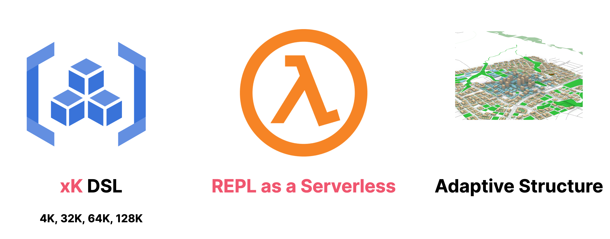
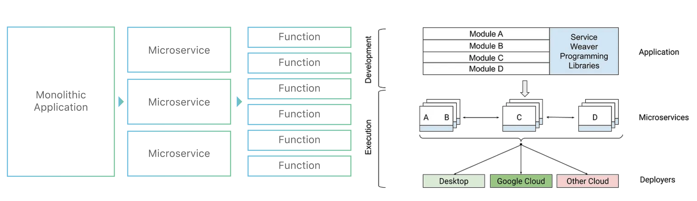

## 未来软件架构：Unit Mesh 架构

> Unit Mesh 是一种基于人工智能生成的分布式架构，与传统的分布式架构不同，Unit Mesh 中的服务单元 (Unit) 是由 AI 生成的，应用程序中的服务和数据抽象为一个个独立的单元，并通过统一的控制平面进行管理和部署。

之所以叫 Unit Mesh，是因为我们写了一个底层服务叫 [Unit Runtime](https://github.com/prompt-engineering/unit-runtime) ，还有参考了 Service Mesh 和 Data Mesh 架构理念，所以 AI 取建议我们叫 \***\*Unit Mesh\*\*** 。

### TLDR 版本

我们初步定义的这个版本（0.1 ，称之为 UnitGenius）有三个核心特性：

- **语言与框架的 DSL**（领域特定语言） 抽象：抽象非编程语言和框架特性，以简化出错的可能性。
- **REPL 即服务**：运行 AI 生成的代码，并提供对应的 API 服务。
- **AI 设计的适应性结构**：自我适应的 API 服务架构，以在不同的环境下自动调整和优化。

开发者可以通过与 AI 交互，生成一定程度的 DSL 抽象化代码，然后在 REPL 即 Serverless 服务上运行和测试这些代码。开发者还可以将这些代码提交给 AI 进行自动化运维，AI 会对代码进行优化和调整，从而进一步提高 API 服务的性能和可靠性。

开始正文的废话版本。

### Unit Mesh 初步 Demo：DSL + REPL = Unit Server

详细过程，见本文的后半部分。

前端页面：[https://prompt.phodal.com/zh-CN/click-flow/unit-mesh-unit-server/](https://prompt.phodal.com/zh-CN/click-flow/unit-mesh-unit-server/)

首先，你需要克隆一下 Unit Server 的代码：[https://github.com/prompt-engineering/unit-server](https://github.com/prompt-engineering/unit-server) 

然后，选择 kotlin-repl 或者 typescript-repl 对应 Kotlin、TypeScript 两种语言。

然后，按对应的 README 运行起你的 Unit Server。

接着，在 ChatFlow 里让 ChatGPT 生成如下的代码，并点击 `Run` 按钮：

```jsx
%spring

@RestController
object Pages {
   @GetMapping("/")
   fun main() = "It works!"
}
```

最后，你就可以得到一个正在运行的服务（该功能还在开发中）：[http://localhost:8080/](http://localhost:8080/hello) ，访问该服务后，如果的应该是 It works。

---

PS：这里有一个手动加入调用 Application 类和调用 main 方法的代码，因为需要做静态分析，才能确定使用的框架，暂时没写在 Unit Server 代码中。

# Unit Mesh 架构

再重复一下定义：

> Unit Mesh 是一种基于人工智能生成的分布式架构，与传统的分布式架构不同，Unit Mesh 中的服务单元 (Unit) 是由 AI 生成的，应用程序中的服务和数据抽象为一个个独立的单元，并通过统一的控制平面进行管理和部署。

### Unit Mesh 核心思想：AI 生成的代码即 Unit

Unit Mesh 是围绕于 Unit 为核心的架构模式。

- AI 生成 Unit。即 AI 应该生成的代码都应该是可运行的 **Unit**，上到前端组件、下到后端服务都是可运行的。
- Human 校验 Unit。由人类来检查和校验 Unit，如果 AI 生成的代码有问题，那么人类只需要修复即可。
- Unit 自适应部署架构。在部署时 Unit 可以自行组成 Serverless 架构、微服务架构、单体架构、Mesh 架构，而不需要人类来干预。

碳基嘛，就适合当一个 Verifier。

### Unit Mesh 架构核心要素

结合我们设计的 Unit Server，我们设计的 Unit Mesh 架构由以下三要素构成：



#### 语言与框架的 DSL 抽象：封装不稳定的抽象

由于 AI 生成的代码会有各种问题，诸如于无法对接内部的云平台、出错的 imports 等等，所以我们要设计领域特定语言来解决这个问题，并封装抽象。

简单来说：我们需要**抽象将所有不稳定的元素**，便能构建出稳定的元素。

详细的设计会在后面的 Unit Server 部分展开。

---

PS：而由于大语言模型是有上下文能力限制的，像我这样的、搞不到充值的就只配 4k。因此，我设计的 Unit 要称之为 4k Unit Mesh，我设计的 DSL 要称之为 4k Unit DSL，有的人可能就是 99k DSL。

#### REPL 即服务：AI 代码修复师的

在有了 DSL 之后，我们还需要一个 REPL （Read-Eval-Print Loop）服务，能直接运行起 AI 生成 的 Unit，然后让人类来测试生成的代码是否是正确。如果生成的 AI 有错误，就需要 AI 代码修复师来对代码进行修复。

而对于一个服务来，如果我们是一个 API，就需要是 Serverless 服务，这就是为什么我们在图里称之为：REPL 即 **Serverless** 服务。详细可以参见后面设计的 Unit Server。

#### AI 设计的适应性结构

人类设计系统的一个缺点是，如果设计时、开发时、运行时的单元不一样，那么就会出现各种疑虑。于是，我们会偏向于设计成三态一致的架构模式，而这本身对于架构的适应性优化就是个问题。

而既然，代码都是 Unit。那么，设计时可以是微服务，开发时可以是 Serverless，线上可以是单体。正如 Google 的 Service Waver 所做的事情：我们不决定运行时的架构，让你来选择。

所以，AI 怎么运行我们的 Unit，就让 AI 来决定吧。



---

PS：本来吧，标题应该是适应性架构（Adaptive Architecture），但是我想了想就只是代码结构之类的，又重新考虑了一下。

# Unit Mesh 设计心得：反直觉才是出路

在去年年底，研究低延迟架构之时，便被这个领域的各种**反直觉**架构模式所震撼，诸如于：GC 是问题那就不要 GC。

因此当设计 Unit Mesh 时，我们的问题依旧是：**如何 Open your mind**。即抛开现有的思维模式和固有知识，打破常规思考，所以我们的主要挑战是如何**拓展思维，开放心智**。

#### 要点 1：如果分层架构是瓶颈，那么就不要分层架构

在那篇《未来可期的 AI 编程里》分层架构是我们最大的挑战，于是，提出理想的方式就是 Serverless + FaaS 的方式，而这种方式则是基于现有的械，又过于理想化。

而随着我们写了 UnitServer 之后，我们发现，还可以 Class as a Service 的方式嘛（手动狗头）。

既然我们的代码运行在云端，由 AI 生成的，那么人类还要看代码吗？人类要在什么时候看代码？无非就是检入的时候，还有审查架构的时候，所以只需要在**审查**的时候，生成架构不就行了。

示例：我想分析 xx 服务的调用情况，以及对应的代码，**请**帮我调取出来。

#### 要点 2：如果依赖是问题，那么就不要依赖

我们遇到的第二个挑战是依赖问题，而依赖是两个问题：

- 项目的库依赖。即类似于 Gradle、Maven、NPM 这一层的库依赖
- 代码依赖。即代码源文件的 `import`

复读机 ChatGPT 并不能很好解决问题，所以就要让 GPT 忘记这些。理想的编程体验，应该是我要用 Spring，智能就会自动分析依赖，如 Intelij IDEA。所以，我们在 UnitServer 中采用了 `% spring` 样的 Jupyter magic 语法 ，以自动解决这两类问题。

#### 要点 3：如果 Serverless 部署是问题，那么就不用 Serverless 部署

起初在 Unit Server 里，我们把 Unit Server 设计成了一个类 Serverless 架构，所以我们遇到了一个问题：Serverless 架构的成本并非所有的人能接受的。所以，我们只需要在测试 Unit 时，采用 Serverless 作为开发时，在线上合并成一个单体或者微服务架构，那么就能完美解决这个问题。

而在这时，还需要突破刚才的分层架构，既然每次代码是生成的，那么我们只需要一个包名即可，诸如于： `org.clickprompt.unitmesh` ，所有的代码都在这个包下；又或者，我们可以通过业务进一步划分成不同的包，结合工具来对代码进行归类。

#### Unit Mesh 探索之路：从 REPL 到 UnitServer

上面讲的太理论了，来看看我们的探索之路，一共分为四步：

1. 从最小的 Hello, world 开始优化
2. 构建一个 REPL 环境
3. 抽象、简化设计 ← 重复
4. 接入真实世界的 Prompt

详细可以查看 Unit Server 和 ChatFlow 的提交纪录。

#### 从最小的 Hello, world 开始

首先，让我们看一个 Kotlin Script 编写的 Spring 的 Hello, World:

```kotlin
@file:DependsOn("org.springframework.boot:spring-boot-starter-web:2.7.9")

import ...
import java.util.*

@Controller
class HelloController {
    @GetMapping("/hello")
    fun helloKotlin(): String {
        return "hello world"
    }
}

@SpringBootApplication
open class ReplApplication

fun main(args: Array<String>) {
    ...
}

main(arrayOf("--server.port=8083"))
```

在这个示例里，你会发现一系列的无用代码，依赖信息、import 信息、main 函数。而作为一个 4k Unit Mesh 的创作者，我必须把这些不稳定的无用信息去掉，才能正确运行，所以它变成了：

```kotlin
%use spring

@Controller
class HelloController {
    @GetMapping("/hello")
    fun helloKotlin(): String {
        return "hello world"
    }
}
```

这样一来，我只需要让 ChatGPT 返回 Controller 即可。

#### 构建 REPL 环境：WebSocket + %magic

既然，我们已经有了一个简化的 DSL，接下来就是引入 Kotlin Script 来构建一个 Unit Serverless 服务器，也就是我们的： [https://github.com/prompt-engineering/unit-server](https://github.com/prompt-engineering/unit-server) 。

Unit Server 的源码是基于 Kotlin Jupyter API 所构建的，而 Kotlin Jupyter 则是封装了 Kotlin 的 REPL 环境。我们之所谓基于 Kotlin Jupyter 而不是 Kotlin REPL 的主要原因是，可以使用 magic 和 DSL 来抽象细节，诸如于：

```kotlin
"spring" to Json.encodeToString(
    SimpleLibraryDefinition(
        imports = listOf(
            "org.springframework.boot.*",
            "org.springframework.boot.autoconfigure.*",
            "org.springframework.web.bind.annotation.*",
            "org.springframework.context.annotation.ComponentScan",
            "org.springframework.context.annotation.Configuration"
        ),
        dependencies = listOf(
            "org.springframework.boot:spring-boot-starter-web:2.7.9"
        )
    )
)
```

即可以自动添加 Spring 的依赖和 Import 信息，就可以支持步骤的 Hello, World 方式。除了 Spring，我们还需要其它的库的 magic。

最后，再使用 WebSocket 暴露出这个接口，以提供给 ChatFlow 使用。

#### 抽象、简化设计 ← 循环

当然了，只是有一个 hello, world 是不够的，所以我们需要更多的例子，诸如于接入数据库。而由于 Spring 的扫描机制影响，外加我们并不想（主要是不会）针对 Spring 做太多的特化，所以我们换成了 Kotlin 里 Kotr 框架。

PS：值得注意的是，我们还需要对框架进行抽象，但是 Ktor 对我们预期的好一点。所以，我们的第二个版本来了：

```kotlin
%use kotless
%use exposed

data class User(val id: Int, val username: String)

class Server : KotlessAWS() {
    override fun prepare(app: Application) {
        Database.connect("jdbc:h2:mem:test", driver = "org.h2.Driver")

        transaction {
            SchemaUtils.create(Users)
        }

        app.routing {
            post("/register") {
                val user = call.receive<User>()
                val id = transaction {
                    // Insert the new user into the database
                    Users.insert {
                        it[username] = user.username
                    } get Users.id
                }

                val newUser = User(id, user.username)
                call.respond(newUser)
            }
        }
    }
}

object Users : org.jetbrains.exposed.sql.Table("users") {
    val id = integer("id").autoIncrement()
    val username = varchar("username", 50).uniqueIndex()

    override val primaryKey = PrimaryKey(id, name = "PK_User_ID")
}
```

在这个版本里，我们使用了 Exposed 作为数据库的 ORM，使用 H2 作为数据库。当然，要拿这个代码作为 Unit 还差了 10% 的距离，不过，基本上已经可以解决大部分的 CRUD 场景。

PS 1：这里的 KotlessAWS 只是一个 AWS Serverless 的抽象，并不影响我们的操作，我们可以直接封装一个 UnitMesh 的类，就是懒。

PS 2：我们只需要通过静态分析拿出 routing 中的代码，再优化即可。更多的探索过程代码可以见：[\_samples](https://github.com/prompt-engineering/unit-server/tree/master/kotlin-repl/_samples) 。

#### 一个真实世界的 Prompt

现在，让我们来结合 AI 跑一下：

```kotlin
请帮我使用 Ktor + Kotlin + Exposed 实现一个用户注册的 RESTful API，要求如下：

- 涉及到数据库的地方，请直接使用 Database.connect。
- 只返回核心逻辑，并写在 Server 类里，我要部署在 Serverless 服务器里。
- 请使用 Kotlin DSL 的方式编写代码。
- 不返回其它的无关代码，如：注释、依赖、import 等。

最后，你只返回类的代码，返回格式如下：
```

```kotlin
class Server : KotlessAWS() {
    override fun prepare(app: Application) {
        Database.connect("jdbc:h2:mem:test", driver = "org.h2.Driver", user = "root", password = "")
        transaction {
            SchemaUtils.create(Users)
        }

        app.routing {
            {{{}}}
        }
    }
}
```

人生苦短，欢迎加入我们的 Watchlist，一起讨论未来。

### Join Waitlist

狗头，现在 **Waitlist 工程师**们，你可以就加入 Unit Mesh 的 Watchlist：

[https://github.com/prompt-engineering/unit-mesh](https://github.com/prompt-engineering/unit-mesh)
