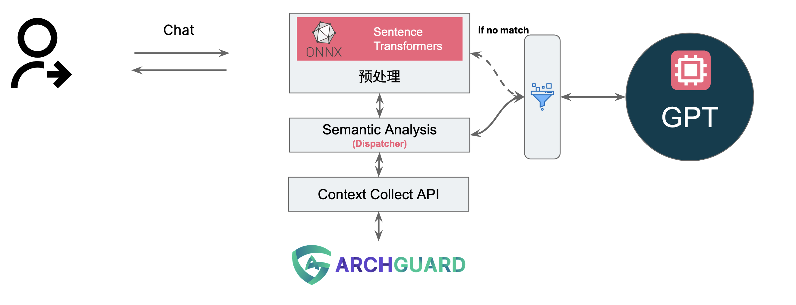
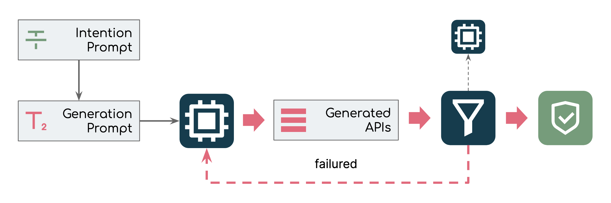
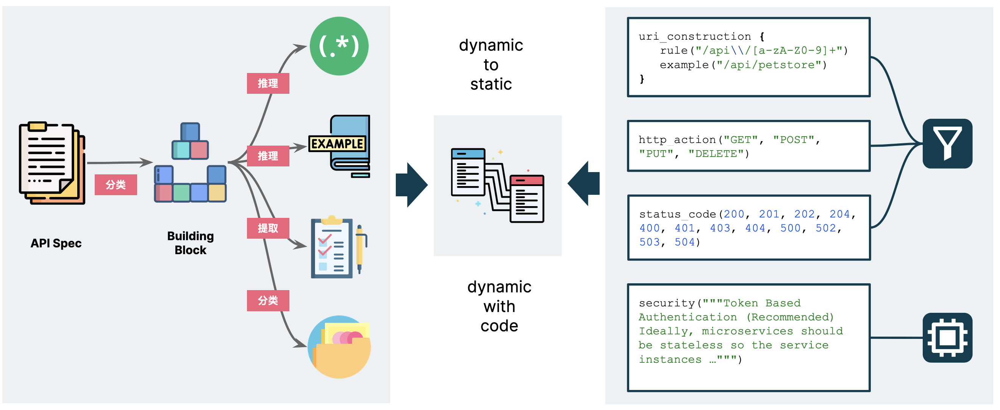
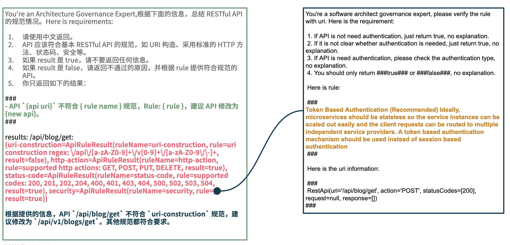
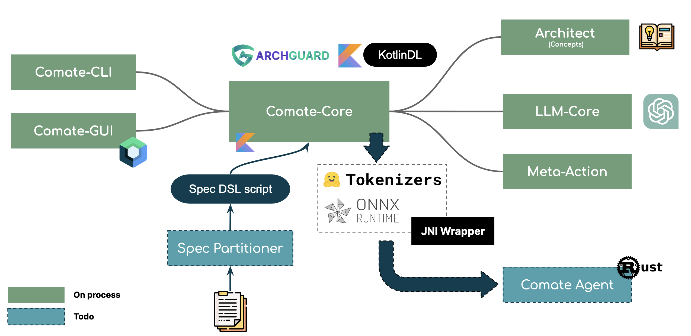

# 场景示例：ArchGuard Co-mate

# 原子能力映射

在过去的几个月里，为了探索了 LLM 结合 SDLC、BizDevOps 的可能性，我们（Thoughtworks 开源社区）创建了 [ClickPrompt](https://github.com/prompt-engineering/click-prompt)、 [AutoDev](https://github.com/unit-mesh/auto-dev)、[DevTi](https://github.com/unit-mesh/devti) 等一系列的开源项目。从个人的经验来看，未来越来越多的应用将围绕于 [LLM@Core](https://www.phodal.com/blog/llm-at-core-for-developer/) 设计，所以我们挖了一个新的坑、新的试验：ArchGuard Co-mate：[https://github.com/archguard/comate](https://github.com/archguard/comate)，欢迎来入坑一起探索和研究。

## Why is Co-mate ？

我们发起 Co-mate 项目的原因，可以归于：**在 LLM 优先的应用开发时代，掌握相关的开发技能**。这些相关的技能包含但是不限于：

- 探索是否存在更好的交互模？如基于 Chat 的动态 UI（DSL）生成 等。
- 适用于 JVM 体系下的 LLM 应用开发？如 JVM 版 LangChain、Embedding 等。
- 如何辅助上下文理解、构建的本地小模型？即 Sentence Transformer + ONNX 的本地处理。
- 如何设计新一代、适用于 LLM 的软件 API？即如何以确定性的方式与 ArchGuard API 交互。
- 如何更好地构建上下文，以工程化的方式构建 AI 应用的上下文（即 prompt）？

而出于架构治理的场景，我们则是想探索：

- 如何让 LLM 解释软件架构给人听？毕竟，让人理解构建都是一件费力的事情。
- 如何让 LLM 基于代码、分层、依赖关系等，解释架构、业务？
- 如何让 LLM 更好地理解规范，从文档出发，去设计软件架构？

每个问题都足够的有意思，并且具备一定的**业务和技术复杂度**，足以让我们掌握基于 LLM 的软件架构所需要考虑的因素。

## What is Co-mate ?

作为一个探索性的项目，解释 Co-mate 的用途并不是一件容易的事情。一个架构师的助手能做到什么程度，我们还没有想得足够的清晰 —— 因为我们还没对架构的定义达到一致意见。

但是呢，先让我们看看 Co-mate 当前的处理流程：



从表面上看，基本上和主流的 AI 应用没有区别；从实际代码上来看，和主流的 AI 应用也看不出多大的区别。还是让我们看看两个典型的 Co-mate 场景。

### 示例 1：介绍一下这个系统

当用户在 Co-mate 中去分析 Co-mate 时，会返回类似于如下的结果：

> Co-mate 项目是一个 AI 助手应用程序，使用了 Jetpack Compose、RxJava、DataStore 等一系列相关的库来构建设计和治理工具等功能。该应用还使用了一些第三方库来构建用户界面，如 Coil-Compose、Voyager Navigator 等，以及进行深度学习推理任务，如 Kotlin Deep Learning API、Inference API 等。该应用需要考虑高效的算法和模型推理能力等非功能需求。
>

对于这个场景下，其数据处理过程如下：

1. 匹配本地相关的指令（如 “分析系统”）
    1. 如果匹配到，则直接调用 AG API 来构建上下文。
    2. 如果没有匹配到，则调用 LLM 进行选择命令，然后可以调用 AG 原有 API。
2. 调用 AG API 构建上下文（项目信息、软件依赖信息等）。
3. 调用 LLM 进行总结，并返回给用户。

所以，我们尝试构建两个新的 API：本地语义分析、（动态）上下文收集 API。

### 示例 2：API 规范性检查

基于 ArchGuard 的能力，我们挑选的第二个场景是检查 API 是否规范。当你有一个 Controller 里的 API 需要检查是否符合 API 规范时，就可以执行：`检查 API 规范` 。

假设你的 API 是：`/api/blog/get` ，并且已经通过 `spec-partitioner` （还没有实现）转换了你的 API 规范。

最后，Co-mate 会返回：

> API '/api/blog/get' 不符合 URI 构造规范，Rule: uri construction regex: \/api\/[a-zA-Z0-9]+\/v[0-9]+\/[a-zA-Z0-9\/\-]+，建议 API 修改为 '/api/blog/v1/get'。
>

（PS：垃圾 GPT 3.5 Turbo，居然认可了 /get）

所以，当你有了完整的架构规范时，那么就可以进入下一代架构生成。



这也是我们想进一步探索的工作。

## How Co-mate works ?

众所周知 GPT 充满了各种不确定性，人们对于 GPT 理解的能力也是不同的。因此，从架构设计的角度来说，我们需要分解 GPT 的原子能力，诸如于**总结、分类、提取、翻译、逻辑推理**，消除其中的不确定性因素，再由我们的软件封装 API 提供动态能力。

### 分层架构与 ArchGuard 能力映射

在示例 1 中，我们做的第一件是**分解架构与数据**，**按不同的架构元素分析**。因为我们对于架构缺乏统一的定义，所以我从 Global 的 slides 找了一个适合于 LLM 理解的分层架构、并且也适用于 ArchGuard 表达。随后，构建了一个不太成功的分层与所需要的上下文数据映射：


于是在示例 1 里，我们给的 prompt 模板是：

> {xxx} 项目是一个 {channel type} 应用程序，使用了 Jetpack Compose、{xxx} 和一系列相关的库来构建 {xxx} 等功能。该应用还使用了一些第三方库来构建用户界面 {xxx}，以及进行 {xxx} 等任务。该应用需要考虑 {xxx} 等非功能需求。
>

在这个 prompt 里，它依赖于两个主要数据： 项目介绍与项目的技术栈（依赖信息）。技术栈可以直接从 ArchGuard SCA 中获取，而项目介绍则是从 [README.md](http://README.md) 中解析得到的。

### LLM 与 Co-mate API 的能力映射

在示例 2 中，我们做的第一件事是**分解 API 文档**， **按不同 LLM 的原子能力进行分解**。构建出四种不同的原子能力：

- 推理出适用于 URI 的正则表达式。
- 推理出一个合理的 example。
- 提取一些 checklist，诸如于状态码、HTTP Action 等。
- 将剩下的不确定性内容，扔到一起。

如下图所示：



在右侧，我们则构建了一个 Kotlin Typesafe DSL，以动态的加载到系统中（未来），每一个函数对应到一个 Rule。

```kotlin
rest_api {
    uri_construction {
        rule("/api\\/[a-zA-Z0-9]+\\/v[0-9]+\\/[a-zA-Z0-9\\/\\-]+")
        example("/api/petstore/v1/pets/dogs")
    }

    http_action("GET", "POST", "PUT", "DELETE")
    status_code(200, 201, 202, 204, 400, 401, 403, 404, 500, 502, 503, 504)

    security("""Token Based Authentication (Recommended) Ideally, ...""")

    misc("""....""")
}
```

作为一个 demo，这个 DSL 依旧具备很大的完善空间。其中比较有意思的部分在于 security 和 misc 部分，这些不确定性正好适用于 LLM 进行推理。所以，在执行对应的 misc、security 规则检查时，会再调用  GPT 来检查：



以将其中的确定性与不确定性更好的结合，进而充分地利用了 LLM 与 ArchGuard 的能力，并减少对 GPT 的消耗。

## Welcome join us

下图是，当前 ArchGuard Co-mate 的所有模块：



简单介绍如下：

- Comate-Core 提供了 CLI 和 GUI 所需要的基本能力，
- Meta-Action 则是定义了基本的 Action
- Architecture 定义了什么是 Co-mate 理解的架构
- LLM-Core 则是对于 LLM 的调用 。
- Spec Partitioner 则是计划对于规范的提取与自动生成（当前都是手动 prompt）

而我们在采用 JVM 技术栈的时候，遇到了几个坑 KotlinDL 和 Deep Java Library 都是通过 JNI/Rust 的方式调用了 HuggingFace Tokenizers、ONNX API，导致了应用在 macOS 下 crash。而一种理想的方式应该是通过 JSON RPC 的方式来调用，所以我们计划使用 Rust 构建一个新的模块：Comate Agent。

所以，如果你对使用 JVM 技术栈来开发 AI 应用，对 Rust 技术栈来开发 AI 应用，欢迎来加入我们。
