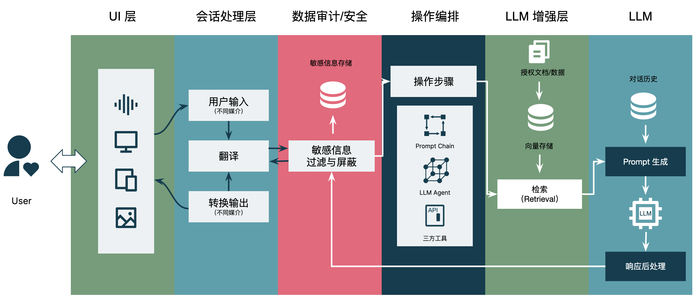

# LLM 应用架构设计：LLM 参考架构

## LLM 参考架构

对于大语言模型应用来说，在设计架构时，除了考虑编排等，还需要考虑到：数据敏感和安全等问题。如下是一个参考架构：



- UI 层：用户界面层，提供给用户与语言模型交互的界面，可以是网页、移动应用、命令行界面等。
- 会话处理层：处理用户与语言模型之间的交互会话，包括对用户输入的解析、对话管理、上下文维护等功能。
- 数据审计层：负责对用户数据进行审计和保护，防止数据泄露、滥用或被攻击。这个层次也可以包括对模型的安全性和可信度进行评估。
- 操作编排层：这个层级可以管理和协调多个语言模型、工具、智能体的运行，比如多个模型之间的调用、结果的融合等。它可以作为一个简单的流程引擎，将多个模型组合成复杂的工作流程。
- LLM 增强层：这个层级可以对语言模型进行额外的优化和增强，比如加速推理速度、提供相关上下文、提高模型的准确性、支持特定的任务等。这个层级也可以包括对模型解释性和可解释性的增强。
- LLM 层：最底层是语言模型本身，它是整个架构的核心。它可以是一个基于深度学习的模型，比如 LSTM、Transformer 等，也可以是一个基于传统 NLP 技术的模型。在这个层级，模型会接收输入并输出相应的文本结果。

## ArchGuard Co-mate 示例

ArchGuard Co-mate 是一个 LLM + 架构设计与治理的探索性项目，旨在探索 LLM 作为架构师助手的可能性，并围绕 LLM 来探索架构的未来，诸如于本地语义分析、动态上下文收集 API、架构规范检查等。

在 ArchGuard Co-mate 中，每一个层对应了不同的设计理念/设计原则，如：

- UI：用户意图导向设计
- 会话处理层：语言接口
- 操作编排层：语言接口 + 上下文工程
- LLM 增强层：语言接口
- LLM 层：原子能力映射
- 数据审计层：（由于 ArchGuard 的场景限制，我们并没有设计这一层。

围绕于不同层级需要考虑不同的技术实践。


详细代码见：[https://github.com/archguard/co-mate](https://github.com/archguard/co-mate)

### UI 层：用户意图导向设计

由于 Co-mate 并不是一个通用能力的系统，所以我们希望限制用户使用 ChatGPT 的能力。除此，在 UI 层上，我们尝试去引导客户来了解系统的能力。

诸如于，为了构建目标系统的上下文，我们需要先 clone 代码、进行基本的代码分析，所以我们需要引导用户：


随后，根据用户的输入分析，以分析适合的系统功能是什么，返回给用户来确认。我们将其称为：**请求-生成 UI-确认模式**。


而为了提供及时的返回给用户，我们设计的 DSL 改为**流式 DSL**，即可以实时解析这个 DSL，并及时响应给用户，以显性的告诉用户：系统正在处理您的请求。

### 会话处理层：本地小模型

在 Co-mate 中，我们在本地引入了 **SentenceTransformer** 来处理用户的输入，优先在本地分析、匹配用户的输入，并处理。当匹配到结果后直接调用本地的函数，当匹配不到结果时调用远端的处理函数来处理。

在原理上主要是参考了 GitHub Copilot、 Bloop 的实现，通过本地的小模型来处理用户的输入，然后再通过远端的大模型来处理用户的输入。

在这里，需要用到两个核心组件：

- Onnx Runtime，是一个跨平台推理和训练机器学习加速器。
- HuggingFace Tokenizers，提供当今最常用的分词器的实现，重点关注性能和多功能性。

从某种程度上来说，它们也算是 LLM 增强层的一部分，只是我尝试用来在处理会话请求，以直接调用系统的功能，并返回给用户。诸如于：

```kotlin
mapOf(
    ComateCommand.Intro to basicIntroCommand.map { semantic.embed(it) },
    ComateCommand.LayeredStyle to archStyleCommand.map { semantic.embed(it) },
    ComateCommand.ApiGovernance to apiGovernanceCommand.map { semantic.embed(it) },
    ComateCommand.ApiGen to apiGenCommand.map { semantic.embed(it) },
    ComateCommand.FoundationGovernance to foundationGovernanceCommand.map { semantic.embed(it) },
)
```

针对所有潜在的、相似的命令在本地进行一次简单的检索。

### 数据审计层：（暂时没有）

由于懒，以及其它原因，我们暂时没有添加这个功能。

### 操作编排层：函数即操作

而为了将上述的用户指令转换为对应的系统指令，我们需要结合系统提供的函数功能，交由 LLM 来分析潜在的调用函数是哪一个。

于是，我们参考了 LangChain 的实现，构建了一个轻量级的 API，用来分析用户的输入。当用户输入上述的 Introduce the system … 指令时，我们将通过反射生成函数信息、并生成如下的 prompt，交由 LLM 分析：

```markdown
Answer the following questions as best you can. You have access to the following tools:

introduce_system: introduce_system is a function to introduce a system.

Use the following format:

Question: the input question you must answer
Thought: you should always think about what to do
Action: the action to take, should be one of [introduce_system]
Action Input: the input to the action (parse from the user input, don't add other additional information)
// end in here. the tool will handle the rest

Begin!

Question: Introduce the following system: https://github.com/archguard/ddd-monolithic-code-sample
```

是的，这就是一个手动版的 LangChain 实现。而每一个 “函数” 在实现上其实是一个类 —— 为了能通过反射来创建出这个函数，并实现对应的接口调用。然后，将类名转换为 snake_case 方式，如下代码所示：

```kotlin
val defaultConstructor = clazz.declaredConstructors[0]
val dyFunction = defaultConstructor.newInstance(context) as DyFunction
clazz.name.toSnakeCase() to dyFunction
```

随后，返回对应的函数和输入信息给用户，由用户决定是否调用这个函数。

另外一方面，在 ArchGuard Co-mate 里，我们通过 DSL 来编排功能，而这个 DSL 是由 Kotlin 编写的，并且可以由 ChatGPT 生成的。所以，我们构建了一个基于 DSL 的编排运行时：

```kotlin
// 初始化运行时
val repl = KotlinInterpreter()
val mvcDslSpec = repl.evalCast<FoundationSpec>(InterpreterRequest(code = mvcFoundation))

// 从选择的输入中获取 action
val action = ComateToolingAction.from(action.lowercase())

// 添加默认的 DSL 规范，如 MVC 分层规范
if (action == ComateToolingAction.FOUNDATION_SPEC_GOVERNANCE) {
    comateContext.spec = mvcDslSpec
}
```

当用户没有提供一个架构规范相关的函数时，我们将会生成一个 foundation spec，诸如于默认的 MVC 分层架构的规范。随后，从系统中构建更多的上下文，再交由 LLM 去分析。

### LLM 增强层：借助 LLM 构建精准、简洁的上下文

从意图上来说，LLM 增强层所做的是，根据用户的输入匹配相关的信息，以构建完整的上下文。对于知识型系统来说，通常会借助矢量数据库来实现。而在一些上下文确定的系统来说，也可以借助本地小模型在本地进行计算。

诸如于 GitHub Copilot 会在本地，根据打开的 tab，来计算相关的代码文件，而不需要提前的 index。毕竟，全局的代码 index 会出现一个问题，与当前用户关注的文件上下文出现不匹配性。所以，用户打开的 tab，就是用户潜在的上下文，以些进行分析结果会比较准确。

另外一个场景是 Bloop 会提前对**代码的信息**（如类名、函数名）进行 index，以在用户输入问题时，寻找与问题匹配的代码，再交由 LLM 进行分析。

而在 Co-mate 中，我们是在本地预存一些潜在的用户输入指令，以降低对服务端的请求。

在另外一个层面上，我们还可以借助 LLM 来进行对应的上下文简化，特别是当我们的上下文超长时，就可以以类似的方式来进行精简。诸如于，在 Co-mate 中我们会借助 GPT 来拆解用户的文档，变为 DSL 的方式。

### LLM 层：流式代理接口

在 LLM 层，除了关注于历史数据之外，我们还需要关注于响应反处理，并提供诸如于流式接口的代理等等。
