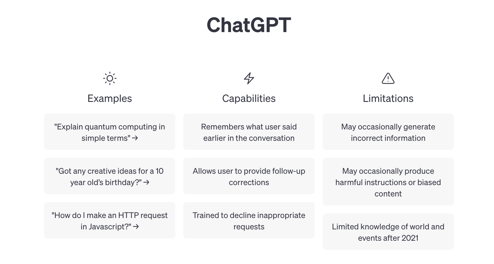
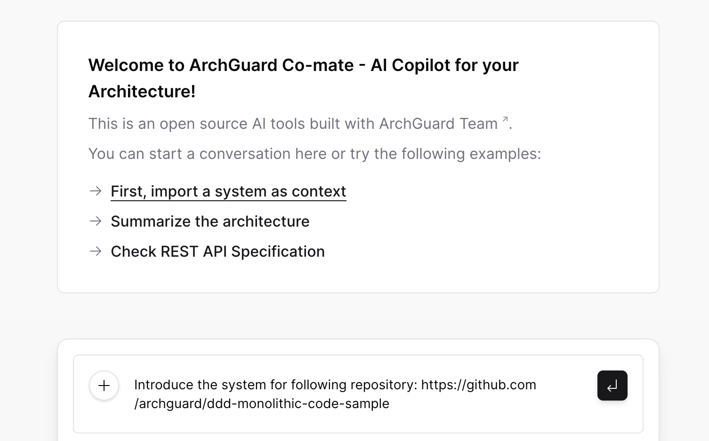
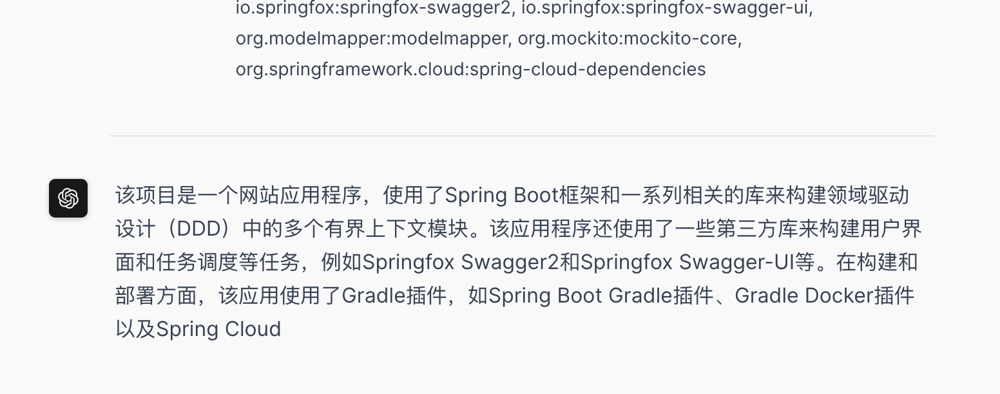
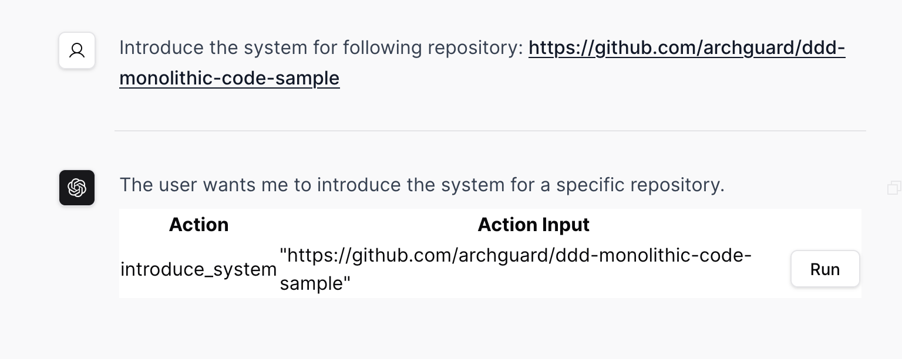

# 用户意图导向设计

通过设计全新的人机交互体验，构建领域特定的 AI 角色，以更好地理解用户的意图。例如，在聊天应用程序中，AI
可以使用自然语言处理来理解用户的意图，从而更好地回答用户的问题。除此之外，还可以探索其他交互方式，如语音识别、手势识别等，以提高用户体验。

## 模式：引导式

LLM 存在的一大局限性是：用户不知道它能做什么，也不知道它能做什么。所以，我们需要引导用户，让用户知道它能做什么，也知道它能做什么。

在 ChatGPT 的首页，我们可以看到一个引导式的设计，它告诉用户，它能做什么，也知道它能做什么：

对于我们的 LLM 应用，我们也可以设计一个引导式的界面，让用户知道它能做什么，也知道它能做什么。如下是 ArchGuard Co-mate
的引导式界面：

Co-mate 要求用户输入一个代码库，即 URL，随后，Co-mate 会自动分析代码库，生成一个代码库的概要的信息。诸如于：

> 该项目是一个网站应用程序，使用了Spring
> Boot框架和一系列相关的库来构建领域驱动设计（DDD）中的多个有界上下文模块。该应用程序还使用了一些第三方库来构建用户界面和任务调度等任务，例如Springfox
> Swagger2和Springfox Swagger-UI等。在构建和部署方面，该应用使用了Gradle插件，如Spring Boot Gradle插件、Gradle
> Docker插件以及Spring Cloud Contract Gradle插件等。该应用还使用了其他库，如ModelMapper和Mockito Core等。同时，该应用需要考虑Spring
> Cloud依赖等非功能需求。

## 模式：实时返回

同样的，对于用户来说，如果一次输入要等很久，那么用户体验就会很差。所以，我们需要实时返回结果，让用户知道它能做什么，也知道它能做什么。

因此，对于我们的应用来说，如果它的解析时间特别长，我们就需要考虑更多的返回方式，类似于 Chat 的随时返回：

尽管我们需要在代码上，进行更多的优化，但是，这样的用户体验，会更好。

## 模式：请求-生成 UI-确认

就当前的 LLM 能力而言，它不能代替我们去坐牢，所以，我们需要由人来确定它的结果是否正确。因此，我们需要设计一个请求-生成-确认模式，如下的截图所示：

每当用户有一些敏感的操作时，我们都需要让用户确认，以避免一些不必要的麻烦。
